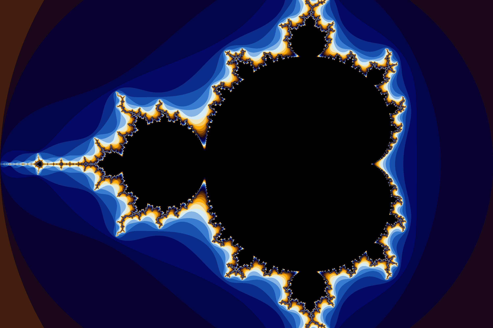

# decaffeinator
Learn Go with side-by-side examples of Python (and Zig!).

## Tagalong
To view the main document head on over to [tagalong/tagalong.md](./tagalong/tagalong.md)

The version with Zig is not included in the repo but can be generated by running:

```sh
cd tagalong
go run .
# tagalong_w_zig.md generated
```

## Generative art examples
Generative art program examples are provided separate to the tagalong document in [`tagalong`](./tagalong/). 

These can be identified as standalone go programs with their identifying folder number being 900+.

Linked below are worthy examples:
- [Mandelbrot](./tagalong/901-mandelbrot/): `go run ./tagalong/901-mandelbrot/`

- [Shirthues](./tagalong/908-shirthues/): `go run ./tagalong/908-shirthues/`

- [Seascape](./tagalong/950-seascape/): `go run ./tagalong/950-seascape/` (may take a long time to render)

[](./tagalong/901-mandelbrot/mandelbrot.go)